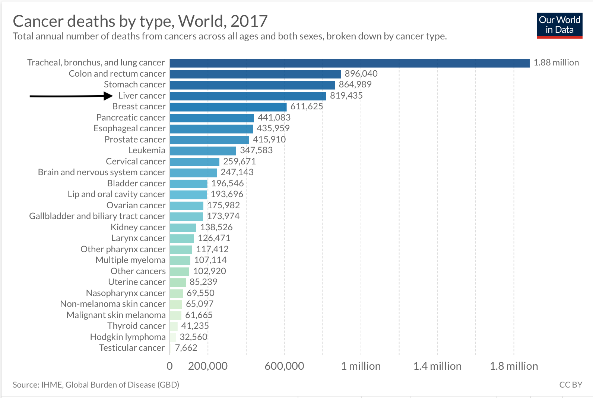
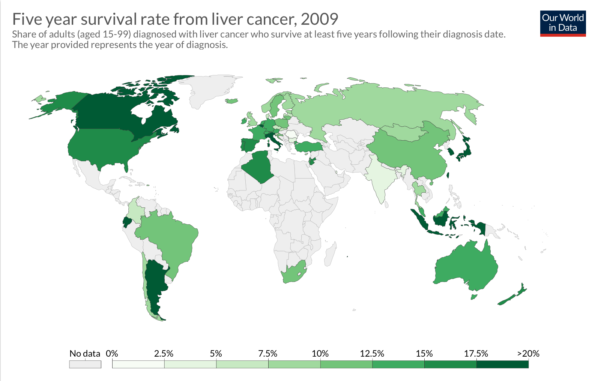
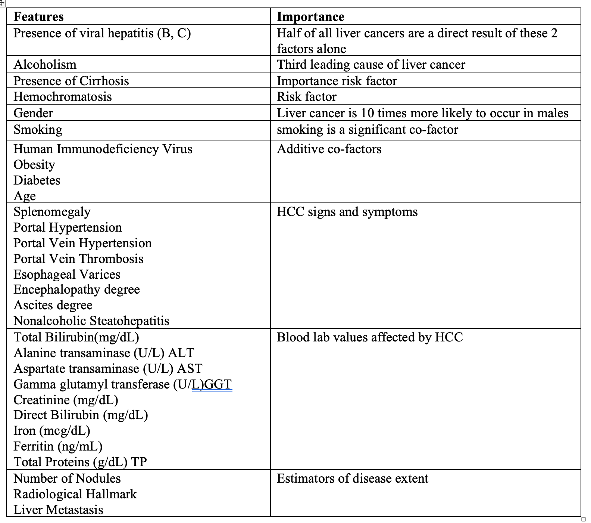
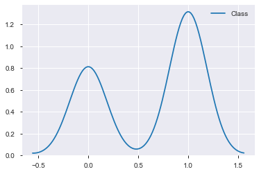
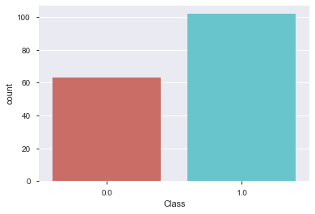
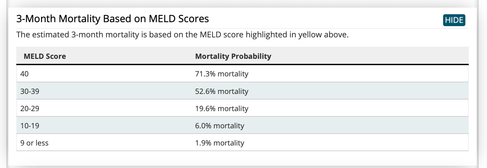
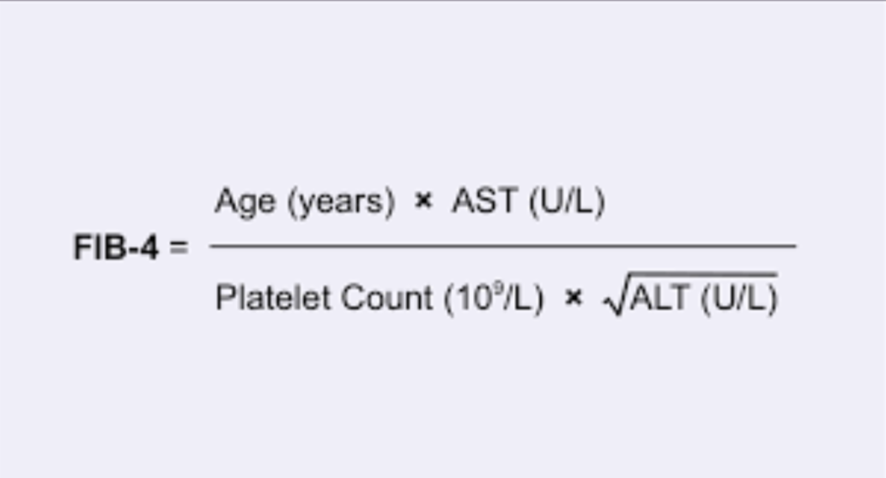
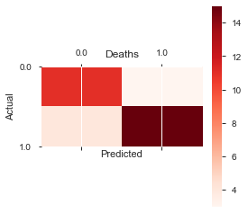
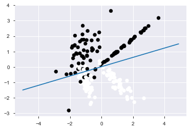
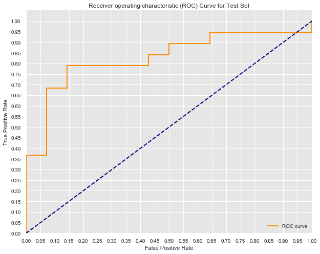

# Predicting One Year Survival of Patients with Hepatocellular Carcinoma: A Logistic Regression Model

### 


## Outline
   - ### Background Information
   - ### Data Summary
   - ### Goal
   - ### Libraries to Import
   - ### Data Exploration/Data Wrangling
   - ### Pandas Profiling Package
   - ### Feature Selection
   - ### Model Buiding/Tuning
   - ### Conclusions


## Background Information


One out of every six deaths that occur in the world are due to cancer.  Cancer is second only to cardiovascular disease in all-cause mortality globally. Liver cancer (hepatocellular carcinoma) is consistently ranked as one of the most common forms of cancer (Figure 1) and is one of the most lethal, with a 5-year survival rate of about 15% in the USA (Figure 2).  


### 
Figure 1


### 
Figure 2

The majority of liver cancer cases are detected at advanced stages of disease, when treatment options are severely limited in both quantity and effectiveness.  With this in mind, more effective screening and earlier cancer detection has the most potential to save lives and reduce disease cost burden. A better understanding of hepatocellular carcinoma and its risk factors is necessary for more effective screening, early recognition, and optimal treatment.


## Data Summary:

This hepatocellular carcinoma dataset consists of patient-data from 165 former patients of Hospital and University Centre of Coimbra (Portugal). The dataset contains 49 features selected according to the EASL-EORTC (European Association for the Study of the Liver - European Organization for Research and Treatment of Cancer) Clinical Practice Guidelines.  The target variable, "Class", is the survival of each patient at 1 year and is represented as 0 (deceased) and 1 (alive).

Many of the features for which patient data was collected are important risk factors for the development of HCC.  In the table below some of the key features included in the model are detailed.


### 


 ## Goal

The purpose of this model, in predicting whether a patient diagnosed with hepatocellular carcinoma will survive past one year in conjunction with established guidelines, has the potential to reduce mortality rate.

This logistic regression model would prove most useful to clinicians, patients, and policy makers alike—as they grapple with the cancer decision making process and potential treatment options.  Ideally, machine learning and statistical models will find a place in depicting a completer and more holistic predictive patient profile. 


## Data Exploration/Data Wrangling

Prior to any data modification, the dataset's percent of missing values was determined to be 10%. 

When exploring the distribution of the target variable "Class", a degree of class imbalance between living patients (1) and deceased patients (0) at the one year mark was observed (Figure 3 and Figure 4).


63 patients were labeled as deceased (0) and 102 patients were labeled as living (1).


Figure 3

### 


Figure 4
### 


- ### Correlation matrix


```python
# Basic correlogram demonstrates minimal correlation among the dataset features
corr = hcc_data_filled.corr()
corr.style.background_gradient(cmap='coolwarm')
```


**Summmary of 49 features:**

Gender                       (1=Male;0=Female)	

Symptoms                     (1=Yes;0=No)

Alcohol	                     (1=Yes;0=No)

Hepatitis B Surface Antigen	 (1=Yes;0=No)

Hepatitis B e Antigen        (1=Yes;0=No)

Hepatitis B Core Antibody    (1=Yes;0=No)

Hepatitis C Virus Antibody	 (1=Yes;0=No)

Cirrhosis                    (1=Yes;0=No)

Endemic Countries	         (1=Yes;0=No)

Smoking                      (1=Yes;0=No)

Diabetes	                 (1=Yes;0=No)

Obesity                      (1=Yes;0=No)

Hemochromatosis              (1=Yes;0=No)

Arterial Hypertension        (1=Yes;0=No)

Chronic Renal Insufficiency	 (1=Yes;0=No)

Human Immunodeficiency Virus (1=Yes;0=No)

Nonalcoholic Steatohepatitis	(1=Yes;0=No)

Esophageal Varices				(1=Yes;0=No)

Splenomegaly					(1=Yes;0=No)

Portal Hypertension			    (1=Yes;0=No)	

Portal Vein Thrombosis			(1=Yes;0=No)	

Liver Metastasis				(1=Yes;0=No)	

Radiological Hallmark			(1=Yes;0=No)	

Age at diagnosis				20-93				

Grams of Alcohol per day		Grams/day	

Packs of cigarets per year		Packs/year		

Performance Status*			    [0,1,2,3,4,5]	

Encephalopathy degree*			[1,2,3]			

Ascites degree*				    [1,2,3]			

International Normalised Ratio*	0.84-4.82		

Alpha-Fetoprotein (ng/mL)		AFP			

Haemoglobin (g/dL)				

Mean Corpuscular Volume	 (fl)	MCV

Leukocytes(G/L)					

Platelets	(G/L)				

Albumin (mg/dL)				

Total Bilirubin(mg/dL)			

Alanine transaminase (U/L)		ALT

Aspartate transaminase (U/L)	AST				

Gamma glutamyl transferase (U/L)GGT			

Alkaline phosphatase (U/L)		ALP				

Total Proteins (g/dL)			TP				

Creatinine (mg/dL)				

Number of Nodules				0-5			

Major dimension of nodule (cm)	

Direct Bilirubin (mg/dL)		

Iron	(mcg/dL)					

Oxygen Saturation (%)			

Ferritin (ng/mL)				

Class Attribute	


### Pandas Profiling Package


```python
hcc_data_filled.profile_report(style={'full_width':True})
```


    ---------------------------------------------------------------------------

    NameError                                 Traceback (most recent call last)

    <ipython-input-17-845668a29a00> in <module>
    ----> 1 hcc_data_filled.profile_report(style={'full_width':True})
    

    NameError: name 'hcc_data_filled' is not defined


## Feature Selection/Engineering
   

- ### Creating MELD (Model for End-Stage Liver Disease) Score Feature
Created a MELD score for each patient in the dataset; MELD scores are use to predict 3 month mortality rates in patients with end-stage liver disease.  It stratifies severity of end-stage liver disease for transplant planning

MELD = [ 0.378 * loge(bilirubin)) + (1.120*loge(INR)) + (0.957*loge(creatinine)) + 0.643 ] * 10

The addition of the MELD score feature increased model accuracy by 2% (from 76% to 78%)
(see MELD score section under model tuning for detailed code)



- ###  Creating Fibrosis-4 (FIB-4) Index for Liver Fibrosis Feature

Created a FIB-4 Index score for each patient.  It is a noninvasive estimate of liver scarring in HCV and HBV patients. (see Fibrosis-4 Index score section under model tuning for detailed code)



## Model Buiding/Tuning

- ### Base Model
Running a base logistic model in which Null values have been replaced with 0's and no additional model tuning or parameter optimization has occurred.


```python
X_zero = zeroed_hcc_data[zeroed_hcc_data.columns[:-1]]
y_zero = zeroed_hcc_data.Class

```


```python
std_scaler = StandardScaler() #StandardScaler() # RobustScaler
X_scaled_zero= std_scaler.fit_transform(X_zero)
```


```python
# Split the data into a training set and a test set
X_train_0, X_test_0, y_train_0, y_test_0 = train_test_split(X_scaled_zero, y_zero, random_state=0)

logreg = LogisticRegression(fit_intercept = False, C = 1e12)
model_log = logreg.fit(X_train_0, y_train_0)
model_log

##run model with test data
y_hat_test_0 = logreg.predict(X_test_0)
y_hat_train_0 = logreg.predict(X_train_0)
```

    /Library/Frameworks/Python.framework/Versions/3.7/lib/python3.7/site-packages/sklearn/linear_model/logistic.py:432: FutureWarning: Default solver will be changed to 'lbfgs' in 0.22. Specify a solver to silence this warning.
      FutureWarning)


```python
residuals = y_train_0 - y_hat_train_0
print(pd.Series(residuals).value_counts())
print(pd.Series(residuals).value_counts(normalize=True))
```

    0    123
    Name: Class, dtype: int64
    0    1.0
    Name: Class, dtype: float64


```python
residuals = y_test_0 - y_hat_test_0
print(pd.Series(residuals).value_counts())
print(pd.Series(residuals).value_counts(normalize=True))
```

    0    41
    1     1
    Name: Class, dtype: int64
    0    0.97619
    1    0.02381
    Name: Class, dtype: float64


```python
print('Training Precision: ', precision_score(y_hat_train_0, y_train_0))
print('Testing Precision: ', precision_score(y_hat_test_0, y_test_0))
print('\n\n')

print('Training Recall: ', recall_score(y_hat_train_0, y_train_0))
print('Testing Recall: ', recall_score(y_hat_test_0, y_test_0))
print('\n\n')

print('Training Accuracy: ', accuracy_score(y_hat_train_0, y_train_0))
print('Testing Accuracy: ', accuracy_score(y_hat_test_0, y_test_0))
print('\n\n')

print('Training F1-Score: ',f1_score(y_hat_train_0,y_train_0))
print('Testing F1-Score: ',f1_score(y_hat_test_0,y_test_0))
```

    Training Precision:  1.0
    Testing Precision:  0.9565217391304348
    
    
    
    Training Recall:  1.0
    Testing Recall:  1.0
    
    
    
    Training Accuracy:  1.0
    Testing Accuracy:  0.9761904761904762
    
    
    
    Training F1-Score:  1.0
    Testing F1-Score:  0.9777777777777777


## Tuning Model

- ### **Utilizing KNN imputed data for missing values**

-Nan's in dataset will be replaced with imputed data via KNN (K nearest neighbors) model; thereby preserving the "patient profile" and providing a more accurate result as oppose to simply filling in null values with means or averages.  


```python
# replace all "?" in the dataset with Nan to prepare for KNN model
hcc_data=raw_hcc_data.replace("?", np.nan)
hcc_data.head()
```


```python
###run KNN model using fancyimpute package
from fancyimpute import KNN

# Use 3 nearest rows which have a feature to fill in each row's missing features
# it returns a np.array which I store as a pandas dataframe
hcc_data_filled = pd.DataFrame(KNN(3).fit_transform(hcc_data))

```

    Imputing row 1/165 with 4 missing, elapsed time: 0.025
    Imputing row 101/165 with 6 missing, elapsed time: 0.039


```python
##the column categories were removed when imputed into model, reinsert column headings
hcc_data_filled.columns = hcc_data.columns
hcc_data_filled.index = hcc_data.index
```


```python
##All Nan's have been replaced with numerical values determined by KNN model
hcc_data_filled.head()
```

- ### **Creating MELD score feature**


```python
### Created a function to compute patient MELD scores and subsequently added a new column to hold these new values
def fxyz(x, y, z):  ##MELD score formula uses Total Bili, INR, and Creatinine
    return (((np.log(x)*0.378) + (np.log(y)*1.120)  + (np.log(z)*0.957)+0.643)*10)

hcc_data_filled['meld_score'] = hcc_data_filled.apply(lambda x: fxyz(x['Total_Bil'], x['INR'], x['Creatinine']), axis=1)
hcc_data_filled.tail()
```


- ### Creating Fibrosis-4 (FIB-4) Index for Liver Fibrosis Feature


```python
### Created a function to compute patient FIB-4 scores and subsequently added a new column to hold these new values
def fibxyz(w, x, y, z):  ##Fib-4 score formula uses age, AST(Aspartate transaminase), Plt (platelet), ALT (Alanine transaminase)
    return (w*x)/(y*math.sqrt(z))

hcc_data_filled['fib_score'] = hcc_data_filled.apply(lambda x: fibxyz(x['Age'], x['AST'], x['Platelets'], x['ALT']), axis=1)
hcc_data_filled.tail()
```


- ### Class balancing via SMOTE (Synthetic Minority Over-sampling Technique)
prior to SMOTE technique, X_train had 115 patient records, after SMOTE, X_train_res had 146 patient records


```python
from imblearn.over_sampling import SMOTE
from sklearn.model_selection import train_test_split

X= hcc_data_filled.drop(["Class"], axis=1)
y = hcc_data_filled.Class


X_train, X_test, y_train, y_test = train_test_split(X, y, test_size=0.2, random_state=0)

print("Number transactions X_train dataset: ", X_train.shape)
print("Number transactions y_train dataset: ", y_train.shape)
print("Number transactions X_test dataset: ", X_test.shape)
print("Number transactions y_test dataset: ", y_test.shape)
```

    Number transactions X_train dataset:  (132, 52)
    Number transactions y_train dataset:  (132,)
    Number transactions X_test dataset:  (33, 52)
    Number transactions y_test dataset:  (33,)


```python
print("Before OverSampling, counts of label '1': {}".format(sum(y_train==1)))
print("Before OverSampling, counts of label '0': {} \n".format(sum(y_train==0)))

sm = SMOTE(random_state=2)
X_train_res, y_train_res = sm.fit_sample(X_train, y_train.ravel())

print('After OverSampling, the shape of train_X: {}'.format(X_train_res.shape))
print('After OverSampling, the shape of train_y: {} \n'.format(y_train_res.shape))

print("After OverSampling, counts of label '1': {}".format(sum(y_train_res==1)))
print("After OverSampling, counts of label '0': {}".format(sum(y_train_res==0)))
```

    Before OverSampling, counts of label '1': 83
    Before OverSampling, counts of label '0': 49 
    
    After OverSampling, the shape of train_X: (166, 52)
    After OverSampling, the shape of train_y: (166,) 
    
    After OverSampling, counts of label '1': 83
    After OverSampling, counts of label '0': 83


## Final Logistic Model 


- ### Grid Search and Standardization

Final model modifications: a grid search to optimize parameters and assign most appropriate penalty weight


```python
# standardizing the data
sc = StandardScaler()
X_train_res = sc.fit_transform(X_train_res)
X_test = sc.transform(X_test)
```


```python
np.random.seed(10)

parameters = {
    'C': np.linspace(0.1, 20, 500)
             }
lr = LogisticRegression(solver='lbfgs')
clf = GridSearchCV(lr, parameters, cv=5, verbose=5, n_jobs=5)
clf.fit(X_train_res, y_train_res.ravel())
```

    Fitting 5 folds for each of 500 candidates, totalling 2500 fits


    [Parallel(n_jobs=5)]: Using backend LokyBackend with 5 concurrent workers.
    [Parallel(n_jobs=5)]: Done   8 tasks      | elapsed:    2.5s
    [Parallel(n_jobs=5)]: Done 183 tasks      | elapsed:    4.0s
    [Parallel(n_jobs=5)]: Done 1083 tasks      | elapsed:   11.2s
    [Parallel(n_jobs=5)]: Done 2343 tasks      | elapsed:   26.8s
    [Parallel(n_jobs=5)]: Done 2500 out of 2500 | elapsed:   28.6s finished
    /Library/Frameworks/Python.framework/Versions/3.7/lib/python3.7/site-packages/sklearn/model_selection/_search.py:813: DeprecationWarning: The default of the `iid` parameter will change from True to False in version 0.22 and will be removed in 0.24. This will change numeric results when test-set sizes are unequal.
      DeprecationWarning)


    GridSearchCV(cv=5, error_score='raise-deprecating',
                 estimator=LogisticRegression(C=1.0, class_weight=None, dual=False,
                                              fit_intercept=True,
                                              intercept_scaling=1, l1_ratio=None,
                                              max_iter=100, multi_class='warn',
                                              n_jobs=None, penalty='l2',
                                              random_state=None, solver='lbfgs',
                                              tol=0.0001, verbose=0,
                                              warm_start=False),
                 iid='warn', n_jobs=5,
                 param_grid={'C': array([ 0.1       ,  0.13987...
           19.04288577, 19.08276553, 19.12264529, 19.16252505, 19.20240481,
           19.24228457, 19.28216433, 19.32204409, 19.36192385, 19.40180361,
           19.44168337, 19.48156313, 19.52144289, 19.56132265, 19.6012024 ,
           19.64108216, 19.68096192, 19.72084168, 19.76072144, 19.8006012 ,
           19.84048096, 19.88036072, 19.92024048, 19.96012024, 20.        ])},
                 pre_dispatch='2*n_jobs', refit=True, return_train_score=False,
                 scoring=None, verbose=5)


```python
clf.best_params_
```


    {'C': 1.5356713426853705}


- ### Running the model

Note: Data was already split into a training set and a test set when performing SMOTE technique 


```python
#Running logistic model on training data
logreg = LogisticRegression(C=1.735, class_weight=None, dual=False,
                                          fit_intercept=True,
                                          intercept_scaling=1, l1_ratio=None,
                                          max_iter=100, multi_class='warn',
                                          n_jobs=None, penalty='l2',
                                          random_state=None, solver='lbfgs',
                                          tol=0.01, verbose=0,
                                          warm_start=False)
model_log = logreg.fit(X_train_res, y_train_res)
model_log
```


    LogisticRegression(C=1.735, class_weight=None, dual=False, fit_intercept=True,
                       intercept_scaling=1, l1_ratio=None, max_iter=100,
                       multi_class='warn', n_jobs=None, penalty='l2',
                       random_state=None, solver='lbfgs', tol=0.01, verbose=0,
                       warm_start=False)


```python
##run model with test data
y_hat_test = logreg.predict(X_test)
y_hat_train = logreg.predict(X_train_res)
```


```python
###Model results
print('Training Precision: ', precision_score(y_hat_train, y_train_res))
print('Testing Precision: ', precision_score(y_hat_test, y_test))
print('\n\n')

print('Training Recall: ', recall_score(y_hat_train, y_train_res))
print('Testing Recall: ', recall_score(y_hat_test, y_test))
print('\n\n')

print('Training Accuracy: ', accuracy_score(y_hat_train, y_train_res))
print('Testing Accuracy: ', accuracy_score(y_hat_test, y_test))
print('\n\n')

print('Training F1-Score: ',f1_score(y_hat_train,y_train_res))
print('Testing F1-Score: ',f1_score(y_hat_test,y_test))
```

    Training Precision:  0.927710843373494
    Testing Precision:  0.7894736842105263
    
    
    
    Training Recall:  0.9746835443037974
    Testing Recall:  0.8333333333333334
    
    
    
    Training Accuracy:  0.9518072289156626
    Testing Accuracy:  0.7878787878787878
    
    
    
    Training F1-Score:  0.9506172839506173
    Testing F1-Score:  0.8108108108108109


```python
acc = accuracy_score(y_test,y_hat_test) * 100
print("Accuracy is :{0}".format(acc))
```

    Accuracy is :78.78787878787878


- ### Confusion Matrix Chart

            prediction                        
               0       1                         
             -----   -----                      
          0 | TN   |  FP               
    actual   -----   -----             
          1 | FN   |  TP   


```python

print('\nConfusion Matrix')
print('----------------')
pd.crosstab(y_test, y_hat_test, rownames=['True'], colnames=['Predicted'], margins=True)
```

    
    Confusion Matrix
    ----------------


<div>
<style scoped>
    .dataframe tbody tr th:only-of-type {
        vertical-align: middle;
    }

    .dataframe tbody tr th {
        vertical-align: top;
    }

    .dataframe thead th {
        text-align: right;
    }
</style>
<table border="1" class="dataframe">
  <thead>
    <tr style="text-align: right;">
      <th>Predicted</th>
      <th>0.0</th>
      <th>1.0</th>
      <th>All</th>
    </tr>
    <tr>
      <th>True</th>
      <th></th>
      <th></th>
      <th></th>
    </tr>
  </thead>
  <tbody>
    <tr>
      <th>0.0</th>
      <td>11</td>
      <td>3</td>
      <td>14</td>
    </tr>
    <tr>
      <th>1.0</th>
      <td>4</td>
      <td>15</td>
      <td>19</td>
    </tr>
    <tr>
      <th>All</th>
      <td>15</td>
      <td>18</td>
      <td>33</td>
    </tr>
  </tbody>
</table>
</div>


- ### Confusion Matrix Graph


```python
df_confusion=pd.crosstab(y_test, y_hat_test, rownames=['Actual'], colnames=['Predicted'], margins=False)

def plot_confusion_matrix(df_confusion, title='Confusion matrix', cmap=plt.cm.gray_r):
    plt.matshow(df_confusion, cmap="Reds") # imshow
    plt.title("Deaths")
    plt.colorbar()
    tick_marks = np.arange(len(df_confusion.columns))
    plt.xticks(tick_marks, df_confusion.columns, rotation=0)
    plt.yticks(tick_marks, df_confusion.index)
#     plt.tight_layout()
    plt.ylabel(df_confusion.index.name)
    plt.xlabel(df_confusion.columns.name)

plot_confusion_matrix(df_confusion)
```





```python
#Calculating FPR (False Positive Rate)
#FPR=FP/(FP+TN)
2/(2+12)*100

```


    14.285714285714285


- ### Logistic Regression Decision Boundary Graph


```python

X=X_train_res
y=y_train_res
X, y = make_classification(200, 2, 2, 0, weights=[.5, .5], random_state=15)
clf = LogisticRegression().fit(X, y)
points_x=[x/10. for x in range(-50,+50)]

line_bias = clf.intercept_
line_w = clf.coef_.T
points_y=[(line_w[0]*x+line_bias)/(-1*line_w[1]) for x in points_x]
plt.plot(points_x, points_y)

plt.scatter(X[:,0], X[:,1],c=y)

plt.show()
```

    /Library/Frameworks/Python.framework/Versions/3.7/lib/python3.7/site-packages/sklearn/linear_model/logistic.py:432: FutureWarning: Default solver will be changed to 'lbfgs' in 0.22. Specify a solver to silence this warning.
      FutureWarning)





- ### Creating the AUC graph


```python
#First calculate the probability scores of each of the datapoints:
y_score = model_log.decision_function(X_test)
   
fpr, tpr, thresholds = roc_curve(y_test, y_score)

y_train_score = model_log.decision_function(X_train_res)
train_fpr, train_tpr, thresholds = roc_curve(y_train_res, y_train_score)

#Seaborns Beautiful Styling
sns.set_style("darkgrid", {"axes.facecolor": ".9"})

plt.figure(figsize=(10,8))
lw = 2
plt.plot(fpr, tpr, color='darkorange',
         lw=lw, label='ROC curve')
plt.plot([0, 1], [0, 1], color='navy', lw=lw, linestyle='--')
plt.xlim([0.0, 1.0])
plt.ylim([0.0, 1.05])
plt.yticks([i/20.0 for i in range(21)])
plt.xticks([i/20.0 for i in range(21)])
plt.xlabel('False Positive Rate')
plt.ylabel('True Positive Rate')
plt.title('Receiver operating characteristic (ROC) Curve for Test Set')
plt.legend(loc="lower right")
print('AUC: {}'.format(auc(fpr, tpr)))
plt.show()
```

    AUC: 0.8270676691729323





## Conclusions and Recommendations

In order to capture the heterogeneity for each patient profile, as well as the dataset class imbalance, a clustering oversampling technique was utilized.  The final model used was a logistic regression model, as it provided higher predictive value compared to other models such as SVM and random forest.  

The performance of the logistic model was assessed by utilizing the performance measures of accuracy, AUC, and F-1 score.  Particular attention was given to minimizing the false positive rate, as the threshold for incorrectly predicting that a patient would live at least 1 more year (Class=1) is minimal.

The logistic regression model returned an accuracy of 82%, an AUC of 83%, and a F-1 score of 83% on the testing dataset.  The false positive rate was calculated to be 14%.  All performance measures improved with the addition of the SMOTE oversampling technique to address class imbalance as well as the creation of two additional features MELD score and FIB-1 Index score.

By providing a convenient HCC diagnostic tool, this model can serve as a supplement in patient decision making.  By combining machine learning’s ability to analyze large datasets in minimal time with decision makers’ context knowledge, more robust and efficient clinical decisions can be made earlier in the disease lifecycle.

Areas of future work include training predictive models on larger patient datasets—a task easier said than done in the realm of healthcare.  Furthermore, applying these models to other disease classification scenarios has the potential to positively impact how decision makers approach diagnoses and optimal treatment options.  The concept of utilizing clustering techniques to fill in missing data for patients may prove promising for future healthcare models that aim to preserve patient profile heterogeneity.


### References

- Miriam Seoane Santos, Pedro Henriques Abreu, Pedro J Garcia-Laencina, Adelia Simao, Armando Carvalho, *A new   
  cluster-based oversampling method for improving survival prediction of hepatocellular carcinoma patients.*  
  Journal of biomedical informatics, 58, 49-59, 2015.

- "Cancer" Roser, M., Ritchie, H. 2019.'https://ourworldindata.org/cancer'


- "Liver Cancer."  2019. *Elsevier B.V.* www.sciencedirect.com/topics/medicine-and-dentistry/liver-cancer
