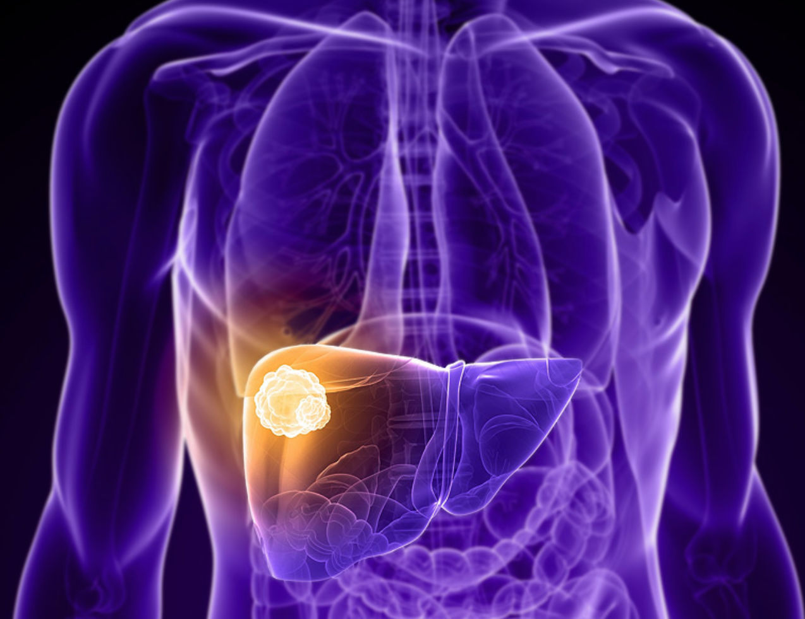
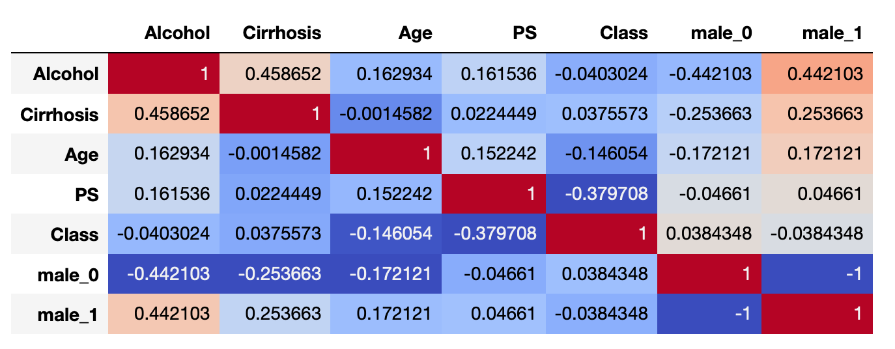

# Predicting One Year Survival of Patients with Hepatocellular Carcinoma: A Logistic Regression Model

### 

## Contents:

- [Background Information](#Background-Information)
- [Goal](#Goal)
- [Data Summary](#Data-Summary)
- [Data Exploration](#Data-Exploration)
- [Feature Engineering and Model Preparation](#Feature-Engineering-and-Model-Preparation)
- [Logistic Model Results](#Logistic-Model)
- [Conclusions and Recommendations](#Conclusions-and-Recommendations)
- [References](#References)

## Background Information

One out of every six deaths that occur in the world are due to cancer.  Cancer is second only to cardiovascular disease in all-cause mortality globally. Liver cancer (hepatocellular carcinoma) is consistently ranked as one of the most common forms of cancer (Figure 1) and is one of the most lethal, with a 5-year survival rate of about 15% in the USA (Figure 2).  

Figure 1: Global Cancer Types
### 

Figure 2: Liver Cancer (Hepatocelluar carcinoma) Survival Rates
### 

The majority of liver cancer cases are detected at advanced stages of disease, when treatment options are severely limited in both quantity and effectiveness.  With this in mind, more effective screening and earlier cancer detection has the most potential to save lives and reduce disease cost burden. A better understanding of hepatocellular carcinoma and its risk factors is necessary for more effective screening, early recognition, and optimal treatment.

 ## Goal

The purpose of this model, in predicting whether a patient diagnosed with hepatocellular carcinoma will survive past one year in conjunction with established guidelines, is to reduce mortality rate secondary to hepatocellular carcinoma.

This logistic regression model would prove most useful to clinicians, patients, and policy makers alike—as they grapple with the cancer decision making process and potential treatment options.  Ideally, machine learning and statistical models will find a place in depicting a completer and more holistic predictive patient profile. 

## Data Summary

This hepatocellular carcinoma dataset consists of patient data from 165 former patients of Hospital and University Centre of Coimbra (Portugal). The dataset contains 49 features selected according to the EASL-EORTC (European Association for the Study of the Liver - European Organization for Research and Treatment of Cancer) Clinical Practice Guidelines.  The target variable, "Class", is the survival of each patient at 1 year and is represented as 0 (deceased) and 1 (alive).

Many of the features for which patient data was collected are important risk factors for the development of HCC.  In the table below some of the key features included in the model are detailed.

### 

## Data Exploration

Prior to any data modification, the dataset's percent of missing values was determined to be 10%. 

When exploring the distribution of the target variable "Class", a degree of class imbalance between living patients (1) and deceased patients (0) at the one year mark was observed (Figure 3 and Figure 4).

63 patients were labeled as deceased (0) and 102 patients were labeled as living (1).

Figure 3: Class Imbalance A

### 

Figure 4: Class Imbalance B
### 

When displayed in a correlogram, one can visualize minimal correlation amongst the original 49 dataset features.

Figure 5: Correlogram (select subset of features)

## Feature Engineering and Model Preparation
   
Prior to running the logistic model, gender was binarized into male and female and two additional features were created.  The first engineered feature is that of a MELD score. The Model for End-Stage Liver Disease Score (MELD) is a widely used clinical scoring method to predict 3 month mortality rates in patients with end-stage liver disease. It stratifies severity of end-stage liver disease for transplant planning.  The second feature created was a Fibrosis-4 Index (FIB-4) score. The FIB-4 Index score is a noninvasive estimate of liver scarring in HCV and HBV patients.  Together these 2 features contributed an approximate 3% improvement to the model's overall predictive ability.

Figure 6: Model for End-Stage Liver Disease Score (MELD)

    
    MELD = [ 0.378 * loge(bilirubin)) + (1.120*loge(INR)) + (0.957*loge(creatinine)) + 0.643 ] * 10

Figure 7: Fibrosis-4 (FIB-4) Index for Liver Fibrosis Feature

    

A unique aspect of healthcare data in general, is the "patient profile" that is created when a broad amount of data is collected for each unique patient.  In order to preserve the heterogeneity of the patient profile and provide a more accurate estimation of missing patient values, missing values were imputed via a K-nearest neighbor (KNN) model.  The most similar of the 3 closest patient records was utilized to fill in the corresponding missing values in question.

In order to address the class imbalance (greater number of living patients at 1 year than deceased) inherit to the HCC dataset, SMOTE (Synthetic Minority Over-sampling Technique) was utilized. Prior to smote, the training data consisted of 115 patient records, after SMOTE, 146 patient records were available for model training use.

Finally, a grid search was utilized to optimize parameters and assign most appropriate penalty weights prior to running the logistic model.  

## Logistic Model Results

Testing Precision:  0.7894736842105263

Testing Recall:  0.8823529411764706

Testing Accuracy:  0.8181818181818182

Testing F1-Score:  0.8333333333333333

### Confusion Matrix Chart

            prediction                        
                   0       1                         
                  -----   -----                      
               0 | TN   |  FP               
         actual   -----   -----             
               1 | FN   |  TP   

Figure 8: Confusion Matrix

Figure 9: Logistic Regression Decision Boundary Graph

Figure 10: Area Under the Curve (AUC) Graph

## Conclusions and Recommendations

In order to capture the heterogeneity for each patient profile, as well as the dataset class imbalance, clustering oversampling techniques were utilized.  The final model used was a logistic regression model, as it provided higher predictive value compared to other models such as Support Vector Machine (SVM) and Random Rorest Ensemble.  

The performance of the logistic model was assessed by utilizing the performance measures of accuracy, AUC, and F-1 score.  Particular attention was given to minimizing the false positive rate, as the threshold for incorrectly predicting that a patient would live at least 1 more year (Class=1) is minimal.

The logistic regression model returned an accuracy of 82%, an AUC of 83%, and a F-1 score of 83% on the testing dataset.  The false positive rate was calculated to be 14%.  All performance measures improved with the use of KNN (K-nearest Neighbor) to impute missing patient data as well as with the addition of the SMOTE oversampling technique to address class imbalance and the creation of two additional features MELD score and FIB-1 Index score.

By providing a convenient and quickly accessible HCC diagnostic tool, this model can serve as a supplement in patient decision making.  By combining machine learning’s ability to analyze large datasets in minimal time with decision makers’ context knowledge, more robust and efficient clinical decisions can be made earlier in the disease lifecycle resulting in better clinical outcomes.

Areas of future work include training predictive models on larger patient datasets—a task easier said than done in the realm of healthcare.  Furthermore, applying this model to other disease classification scenarios has the potential to positively impact how decision makers approach diagnoses and optimal treatment options.  The concept of utilizing clustering techniques to fill in missing data for patients may prove promising for future healthcare models that aim to preserve patient profile heterogeneity.

## References

- Miriam Seoane Santos, Pedro Henriques Abreu, Pedro J Garcia-Laencina, Adelia Simao, Armando Carvalho, *A new   
  cluster-based oversampling method for improving survival prediction of hepatocellular carcinoma patients.*  
  Journal of biomedical informatics, 58, 49-59, 2015.

- "Cancer" Roser, M., Ritchie, H. 2019.'https://ourworldindata.org/cancer'

- "Liver Cancer."  2019. *Elsevier B.V.* www.sciencedirect.com/topics/medicine-and-dentistry/liver-cancer
